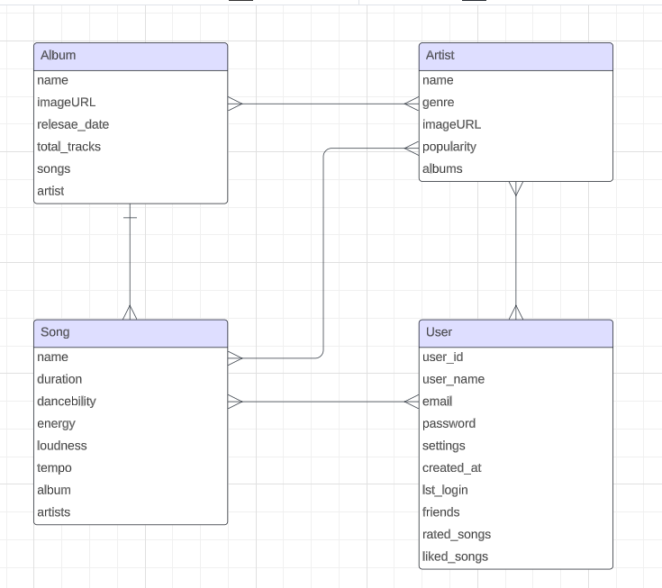

# CS308 - Semester Project - SUpotify

## 🎵 About the Project

This online system provides in-depth analysis of users' music preferences by aggregating their favorite song information from different platforms and generates personalized song recommendations based on the collected data.

## 🚀 Getting Started with Features

### Data Format

The platform collects various data, including song title, artist, album and user ratings. Special attention is paid to different versions of the same song and multiple artist entries.

### Data Collection
   
  * Manual Entry: Users can input song information individually via the interface.
  
  * Batch Entry: Files containing multiple song records can be uploaded to the system.
  
  * Database Import: Users can transfer song information from a database to the system.
  
  * Rating: Unrated songs, albums, or artists can be evaluated and added to the system.

### Analysis of Music Choices

  The system presents various statistics, tables, and graphs based on the collected song information. Users can view this information based on pre-defined criteria.

### Recommendations 

  Personalized music suggestions are made based on user information and different types of analyses.

### Additional Features
   
  * Authentication: Password-based or third-party authenticators can be used.

  * Friendship: Friends can be added within the system, and their activities can be incorporated into analyses.
  
  * Social Media Integration: Analysis results can be shared on social media platforms.
  
  * Data Export: The song rating database can be exported.

### ER Diagram

## 👥 Teams

### Team Leader

   * Ulaş Yıldız

### Backend Team

   * Arda Güney
   
   * Baturalp Öztürk
   
   * Emirhan Böge

### Web Team

   * Atahan Bozkuş
   
   * Mehmet Emin Er
   
   * Zeynep Pancar

### Mobile Team

   * Burak Kurtulmuş
   
   * Zeynep Merve Yaman

## Technologies 

### ☁️ Backend

   * Flask
   
   * Firebase

### 🌐 Web

   * HTML
   
   * CSS
   
   * JavaScript

### 📱 Mobile

   * Android Studio
   
   * Kotlin

## Project Management

### 📋 Jira

Jira is a tool used for the organization and tracking of our project. With functions such as task management, error tracking and reporting of project processes, it allows team work to be carried out in a more organized and efficient manner. Through Jira, we ensure that all team members have constant up-to-date information about their tasks, processes and the overall progress of the project.

### 🔁 Agile Method

Agile is a flexible and iterative approach that we adopt during the development process of our project. This approach ensures that our project progresses quickly and effectively, while at the same time adapting quickly to changing requirements. Within the Agile methodology, we work in sprints of 1 or 2 weeks. Each sprint is defined by specific goals and tasks, and during this process, team members focus on the set goals. At the end of the sprints, the work performed is reviewed and plans are made for the next sprint. This process ensures that our project is constantly evolving and that effective communication and collaboration between team members is maintained.
